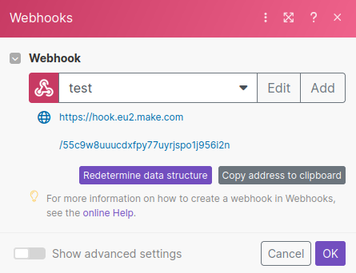

# Integromat (Make) Ruby

<span>[](https://rubygems.org/gems/integromat-ruby)</span> <span>
[](https://github.com/andrewdsilva/integromat-ruby)</span> <span>
</span> <span>
[](http://opensource.org/licenses/MIT)</span> <span>
</span>

Integromat is a powerful automation platform that enables you to connect and automate various applications and services. One of the key features of Integromat is the ability to utilize webhooks, which allow you to send data to Integromat over HTTP. Webhooks act as instant triggers, allowing you to execute scenarios immediately upon receiving a request at the webhook URL.

Integromat-Ruby is a lightweight Ruby gem that simplifies the process of triggering Integromat webhooks from any Ruby application. With just a few lines of code, you can seamlessly integrate your Ruby app with Integromat and automate various tasks.

To start using Integromat-Ruby, you'll need an Integromat account and a created webhook. If you're new to Integromat, don't worry – setting up an account and creating a webhook is straightforward and well-documented on the Integromat website (https://make.com). Once you have your Integromat account and webhook ready, you're all set to integrate it with your Ruby application.

- [Sign up for Integromat (Make)](https://www.make.com/en/register)
- [Webhooks Documentation](https://www.integromat.com/en/help/app/webhooks)

## Installation

To install the gem add it into a Gemfile (Bundler):

```ruby
gem "integromat"
```

And then execute:

```
bundle install
```

## Usage

To use integromat, start by configuring it with a hash of the webhooks you want to integrate. You can also customize the base URI.

```ruby
require "integromat"

Integromat.configure do |c|
  c.web_hooks = { user_register: "webhook_id" }

  # Override the base URI
  c.base_uri = "https://hook.eu2.make.com"
end
```

To obtain the base URL and hook ID, please look at the webhook URL you created in the Integromat application (Make).



Create an instance of `Webhook` for the desired hook, and use the `trigger` method to send a hash of parameters to the Integromat (Make) webhook. The `trigger` method returns `true` if the hook is successfully posted.

```ruby
hook = Integromat::Webhook.new(:user_register)

if hook.trigger({ username: "andrewdsilva" })
  pp "Hook triggered !"
else
  pp "Hook not triggered !"
end
```

## Use Integromat on your Rails application

If you are using Integromat with Rails, I recommend creating an initializer file (e.g., `config/initializers/integromat.rb`) and adding the following code:

```ruby
Integromat.configure do |c|
  c.web_hooks = { user_register: "webhook_id" }

  # Override the base URI
  c.base_uri = "https://hook.eu2.make.com"
end
```

### Example

Suppose you want to call the webhook every time a user signs up for your application. You can use the `trigger` method from the Integromat gem within a callback on your `User` model.

```ruby
class User < ApplicationRecord
  after_create :notify_registration

  def notify_registration
    Integromat::Webhook.new(:user_registration).trigger(email: email)
  end
end
```

This code sets up an `after_create` callback on the `User` model, which calls the `notify_registration` method. Inside this method, the `Integromat::Webhook.new(:user_registration)` creates a new webhook instance for the "user_registration" hook. The `trigger` method is then used to ping the webhook.

## Contributing

Bug reports and pull requests are welcome on GitHub at https://github.com/andrewdsilva/integromat-ruby.

## License

The gem is available as open source under the terms of the [MIT License](https://opensource.org/licenses/MIT).
